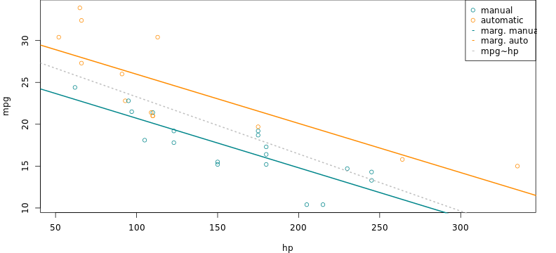

## Explore 1974 Motor Trend dataset


Carsdata - application for exploratory analisys on mtcars dataset.

https://promsoft.shinyapps.io/carsdata/

With this application, we can check how variables related to car fuel consumption.

```
Example model: lm(mpg~am+cyl+am:cyl)
```
For each model, you can access R Squared and reqression coefficients. 


```
##             Estimate Std. Error t value  Pr(>|t|)
## (Intercept)   30.874     3.1882   9.684 1.948e-10
## am            10.175     4.3046   2.364 2.526e-02
## cyl           -1.976     0.4485  -4.405 1.407e-04
## am:cyl        -1.305     0.7070  -1.846 7.551e-02
```

---------------------
## Scatterplot
```
Model: lm(mpg~hp) # How cofounder variable linked to mileage
```

At the Scatterplot tab, we can access
relationship between selectaed 
variable and mileage&nbsp;per&nbsp;gallon,
separately for each transmission type.

 

---------------------
## Box Plot
Cofounder must be similary distributed in both car groups. For example, using number of forward gears as cofounder may be problematic, since number of gears was tightly coupled with transmission type.

 

---------------------
## Resuduals Plot and QQ Plo
```
Model: lm(mpg~am+cyl+am:cyl)
```

 

In these pages some model quality assurance tools was available. We can check our data for heterosсedasticity and check residual distribution for normality. 
